<div align="center">

```
██╗   ██╗ ██████╗ ██╗██████╗
██║   ██║██╔═══██╗██║██╔══██╗
██║   ██║██║   ██║██║██║  ██║
╚██╗ ██╔╝██║   ██║██║██║  ██║
 ╚████╔╝ ╚██████╔╝██║██████╔╝
  ╚═══╝   ╚═════╝ ╚═╝╚═════╝
```

### ◇───────── *The Digital Abyss That Thinks Back* ─────────◇

**AI-powered note-taking for minds that refuse to be ordinary.**<br>
**Cyberpunk aesthetics. Zero backend. Pure browser. Infinite potential.**

<br>


<br>

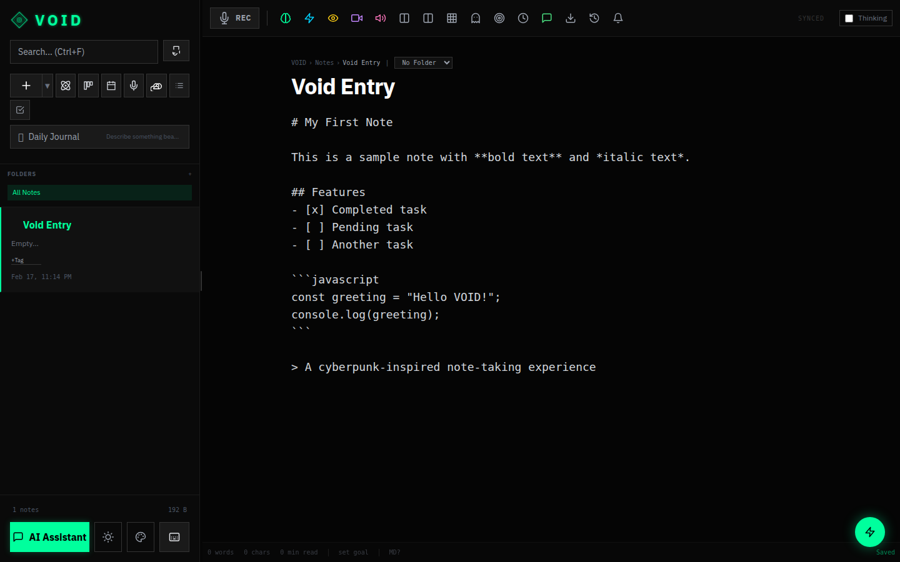

<br>

</div>

---

<br>

## ◈ What Is VOID?

**VOID** is a cyberpunk-aesthetic, AI-powered note-taking environment that runs **entirely in your browser**. No servers. No accounts required. Your thoughts stay yours — persisted locally in IndexedDB with optional Google Drive cloud sync.

It's not just a text editor. It's a **neural workspace** — powered by Google Gemini, VOID can summarize your notes, enhance your writing, generate images and videos from your ideas, fuse two concepts into something new, and even control itself through conversational AI.

> *"Every note you write enters the void. The void remembers. The void connects. The void creates."*

```
┌─────────────────────────────────────────────────────────┐
│  42 features implemented  ·  58 more planned            │
│  ████████████████████░░░░░░░░░░░░░░░░░░░░░░░░░  42%    │
│  ◇ Editor  ◇ AI  ◇ Views  ◇ Organization  ◇ Export    │
└─────────────────────────────────────────────────────────┘
```

<br>

---

<br>

## ◈ Screenshots

<div align="center">

| | |
|:---:|:---:|
| 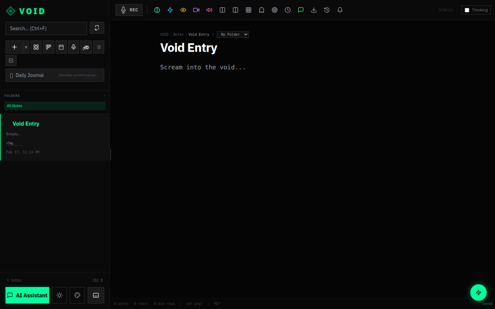<br>**Default Editor** | <br>**Markdown Preview** |
| 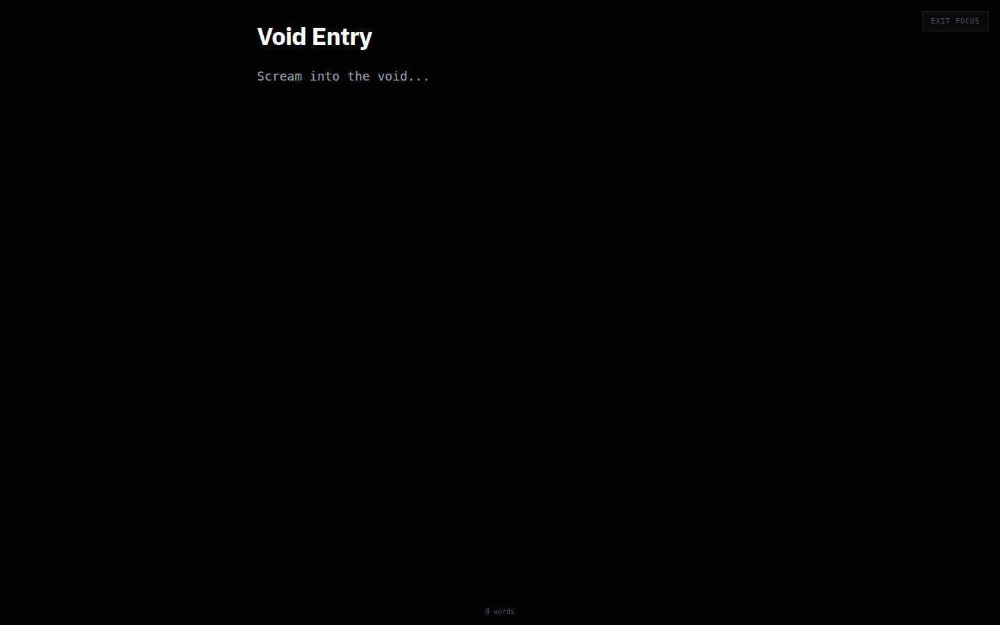<br>**Split Pane Editing** | <br>**Zen Mode** |
| 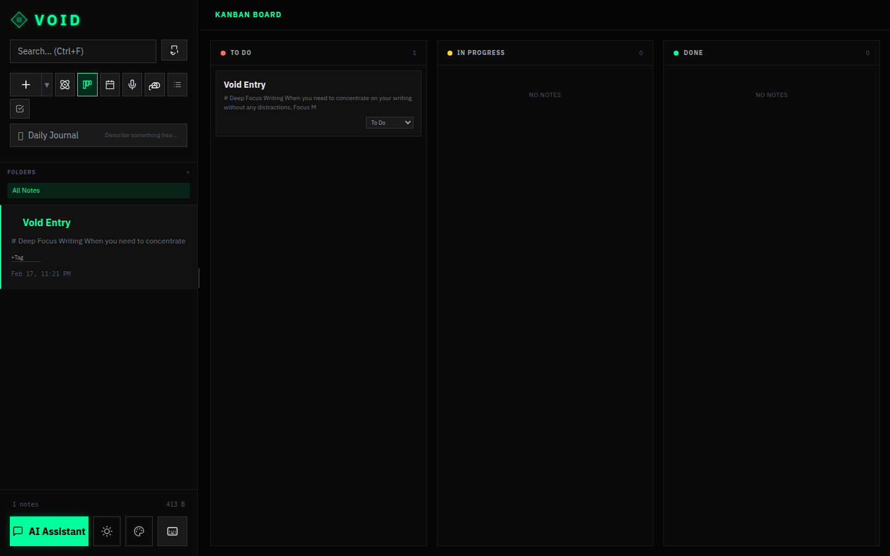<br>**Kanban Board** | 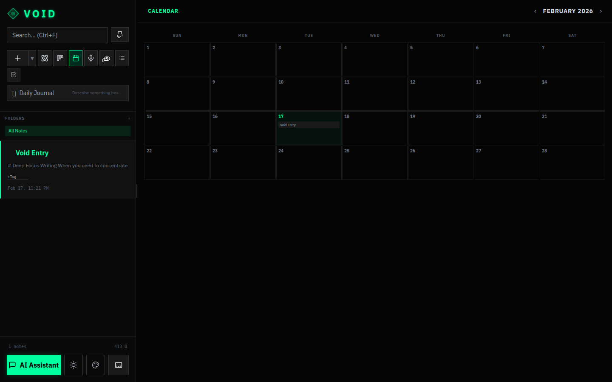<br>**Calendar View** |
| 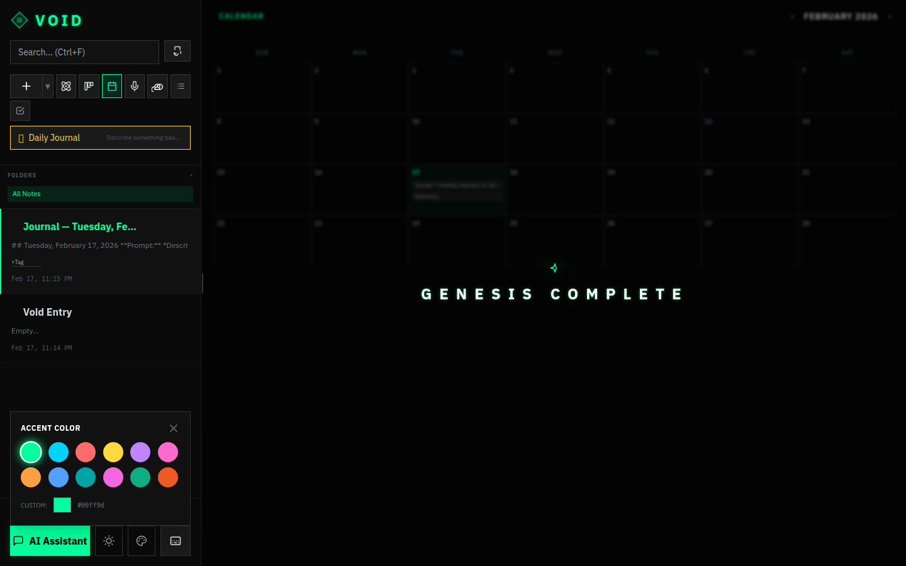<br>**VOID OS Chat** | 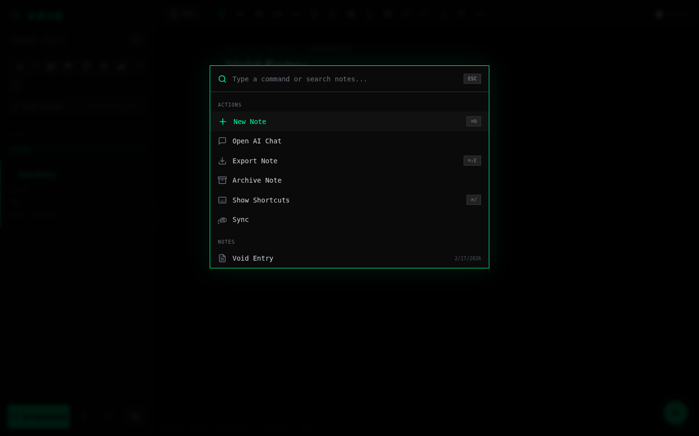<br>**Command Palette** |
| 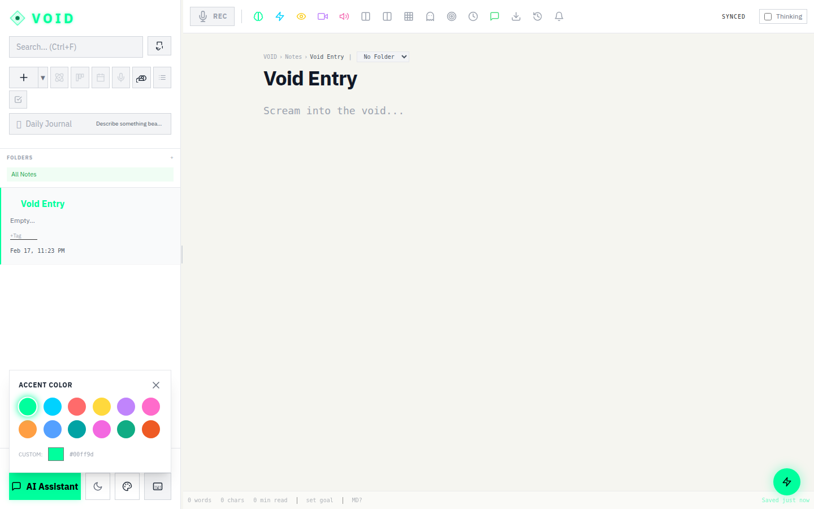<br>**Theme Editor** | 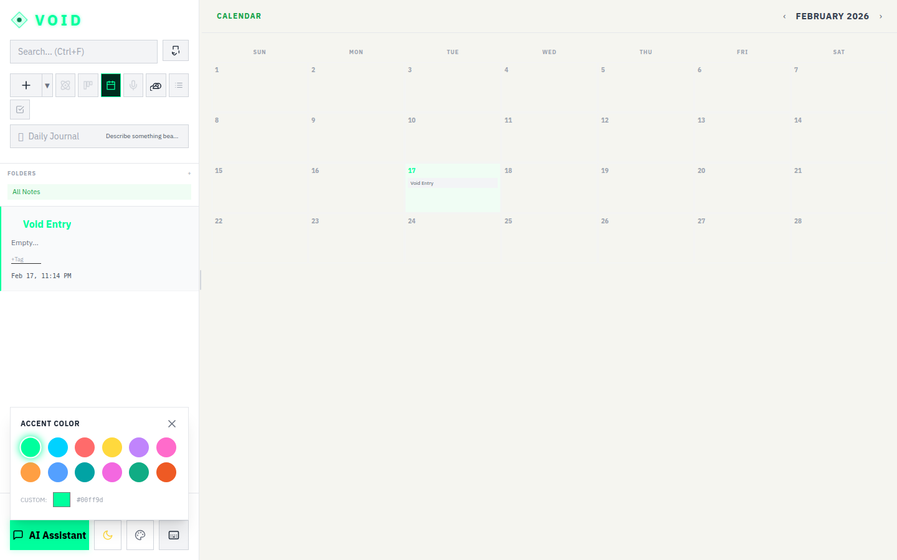<br>**Light Theme** |

</div>

<br>

---

<br>

## ◈ Feature Matrix

<br>

### ⬡ Editor Core

| Feature | Description |
|:--|:--|
| **Rich Markdown Editor** | Live side-by-side preview with GFM support |
| **Slash Commands** | Type `/` to insert headings, lists, code blocks, tables, checklists |
| **Wiki-Style Linking** | `[[note name]]` with autocomplete — build your knowledge graph |
| **Interactive Checklists** | Progress tracking bar updates as you check items off |
| **Code Highlighting** | VS Code Dark+ theme via `react-syntax-highlighter` |
| **Link Preview Cards** | Embeddable rich link cards with metadata |
| **Footnotes** | Academic-style footnote annotations |
| **Tables** | Insert and edit tables via toolbar or `/table` slash command |

### ⬡ Focus & Productivity

| Feature | Description |
|:--|:--|
| **Zen Mode** | Distraction-free fullscreen writing environment |
| **Pomodoro Timer** | Built-in 25/5 work/break cycle timer |
| **Split-Pane Editing** | Two notes side by side for reference or comparison |
| **Word Count Goals** | Set targets with a visual progress bar |
| **Writing Streaks** | Track your daily writing consistency |
| **Note Reminders** | Browser notifications at scheduled times |
| **Version History** | Timeline restore — auto-saves every 30s, up to 50 versions per note |

### ⬡ Organization

| Feature | Description |
|:--|:--|
| **Folders** | Nested folder structure for hierarchical organization |
| **Color-Coded Tags** | Auto-colored by content hash — no manual color picking needed |
| **Pin / Archive / Trash** | Full note lifecycle with restore from trash |
| **Custom Sort** | Sort by updated, created, alphabetical, or size |
| **Bulk Actions** | Multi-select notes for batch archive, trash, or tag |
| **Resizable Sidebar** | Drag handle — adjustable from 240px to 600px |
| **Breadcrumb Navigation** | Always know where you are in your folder tree |

### ⬡ Views

| View | Description |
|:--|:--|
| **📝 Editor** | Default — the markdown editor with toolbar and preview |
| **📋 Kanban Board** | Drag notes between To Do → In Progress → Done |
| **📅 Calendar** | Monthly grid showing notes by creation/update date |
| **🎙️ Live Session** | Voice-interactive AI session with real-time transcription |

### ⬡ Export & Sync

| Feature | Description |
|:--|:--|
| **Export Formats** | Clipboard, Markdown, Plain Text, JSON, HTML, Print |
| **Google Drive Sync** | Push/pull your entire note collection as a cloud backup |
| **6 Templates** | Meeting Notes, Journal, Project Plan, To-Do, Brain Dump, Bug Report |
| **31 Journal Prompts** | Rotating daily prompts to kickstart your writing |

<br>

---

<br>

## ◈ AI Neural Core

<div align="center">

```
┌──────────────────────────────────────────────────────────────────┐
│                                                                  │
│     ◇◇◇  POWERED BY GOOGLE GEMINI  ◇◇◇                         │
│                                                                  │
│     gemini-2.5-flash  ·  imagen-3  ·  veo-2  ·  fenrir-tts     │
│                                                                  │
└──────────────────────────────────────────────────────────────────┘
```

</div>

VOID's AI isn't a bolted-on chatbot. It's woven into the fabric of the application through **9 distinct AI capabilities**:

| System | What It Does |
|:--|:--|
| **📄 Summarize** | Condense any note into key points and takeaways |
| **✨ AI Enhance** | Improve grammar, flow, and formatting while preserving your voice |
| **🖼️ Visualize** | Generate images from your note content using Imagen 3 |
| **🎬 Generate Video** | Create videos from text prompts using Veo 2 |
| **🔊 Text-to-Speech** | Hear your notes read aloud with the Fenrir voice model |
| **⚛️ Neural Fusion** | Select two notes → AI synthesizes a new concept with generated artwork |
| **👻 Haunt** | Find semantically related notes across your entire collection |
| **💬 VOID OS Chat** | Full conversational AI with **16 function-calling tools** — it can create notes, search, manage tags, change themes, and control the entire app |
| **🎙️ Live Session** | Voice-interactive AI with real-time speech transcription |

<details>
<summary><b>◇ VOID OS Chat — Function Calling Details</b></summary>

<br>

VOID OS Chat isn't just a chatbot — it's an **AI operator** for your entire workspace. It uses Gemini's function calling to execute real actions:

- Create, search, and manage notes
- Add and remove tags
- Change themes and accent colors
- Summarize and enhance notes
- Navigate between views
- Generate images and media
- And more — 16 tool declarations in total

Ask it anything: *"Create a meeting notes template tagged with #work"* or *"Switch to dark mode and change the accent to purple"* — and it just does it.

</details>

<br>

---

<br>

## ◈ Tech Architecture

```
╔══════════════════════════════════════════════════════════════╗
║                        VOID STACK                           ║
╠══════════════════════════════════════════════════════════════╣
║                                                              ║
║   ┌─────────────┐  ┌──────────────┐  ┌─────────────────┐   ║
║   │  React 19   │  │ TypeScript   │  │   Vite 6        │   ║
║   │  with Hooks  │  │ Strict Mode  │  │  HMR + Build    │   ║
║   └──────┬──────┘  └──────┬───────┘  └────────┬────────┘   ║
║          │                │                    │             ║
║          ▼                ▼                    ▼             ║
║   ┌────────────────────────────────────────────────────┐    ║
║   │              Tailwind CSS (CDN)                    │    ║
║   │      IBM Plex Sans · JetBrains Mono                │    ║
║   └────────────────────────────────────────────────────┘    ║
║                          │                                   ║
║          ┌───────────────┼───────────────┐                  ║
║          ▼               ▼               ▼                  ║
║   ┌────────────┐  ┌────────────┐  ┌────────────────┐       ║
║   │ IndexedDB  │  │ localStorage│  │ Google Drive   │       ║
║   │ (primary)  │  │ (fallback)  │  │ (cloud sync)   │       ║
║   └────────────┘  └────────────┘  └────────────────┘       ║
║                                                              ║
║   ┌────────────────────────────────────────────────────┐    ║
║   │           Google Gemini API (@google/genai)        │    ║
║   │    Flash · Imagen 3 · Veo 2 · Fenrir TTS          │    ║
║   └────────────────────────────────────────────────────┘    ║
║                                                              ║
╚══════════════════════════════════════════════════════════════╝
```

| Layer | Technology | Purpose |
|:--|:--|:--|
| **UI Framework** | React 19 | Hooks-based, all state in App.tsx via props |
| **Language** | TypeScript 5.8 | Strict typing, interfaces for all data models |
| **Bundler** | Vite 6 | HMR dev server, production builds |
| **Styling** | Tailwind CSS (CDN) | Utility-first, zero border-radius policy |
| **Markdown** | react-markdown + remark-gfm | GFM rendering with custom components |
| **Code Blocks** | react-syntax-highlighter | VS Code Dark+ theme |
| **AI Engine** | @google/genai | Gemini 2.5 Flash, Imagen 3, Veo 2 |
| **Primary Storage** | IndexedDB | Async, structured, large capacity |
| **Fallback Storage** | localStorage | Dual-write for resilience |
| **Cloud Sync** | Google Drive API | OAuth-based push/pull backup |
| **Fonts** | IBM Plex Sans + JetBrains Mono | UI text + code blocks |

<br>

---

<br>

## ◈ Quick Start

### Prerequisites

- **Node.js** 18+ and **npm**
- A **Google Gemini API Key** (for AI features — app works without it, just no AI)

### Boot Sequence

```bash
# 1 ── Clone the repository
git clone https://github.com/your-username/void.git
cd void

# 2 ── Install dependencies
npm install

# 3 ── Set your Gemini API key (optional — for AI features)
export GEMINI_API_KEY="your_gemini_api_key_here"

# 4 ── Launch VOID
npm run dev
```

VOID will be running at `http://localhost:5000`.

### Production Build

```bash
npm run build     # Output to dist/
npm run preview   # Preview the production build
```

<br>

---

<br>

## ◈ Environment Variables

| Variable | Required | Description |
|:--|:--|:--|
| `GEMINI_API_KEY` | Optional | Google Gemini API key — enables all AI features (summarize, enhance, visualize, chat, TTS, video, fusion, haunt, live session). The app is fully functional without it; AI buttons simply won't appear. |

> The API key is loaded via `vite.config.ts` using Vite's `loadEnv` and exposed as `process.env.API_KEY` at build time. Set it as a shell environment variable or in a `.env` file.

Google Drive sync uses OAuth and does **not** require a separate API key — it authenticates through the user's Google account in the browser.

<br>

---

<br>

## ◈ Keyboard Shortcuts

| Shortcut | Action |
|:--|:--|
| `Ctrl + N` | Create new note |
| `Ctrl + S` | Force save + snapshot version |
| `Ctrl + K` | Open Command Palette |
| `Ctrl + F` | Focus search bar |
| `Ctrl + /` | Show keyboard shortcuts |
| `Ctrl + Shift + E` | Export current note |
| `Ctrl + Delete` | Archive current note |
| `Ctrl + Shift + Delete` | Permanently delete note |
| `Ctrl + 1-9` | Switch to note by index |
| `Escape` | Close any open modal/overlay |
| `/` *(in editor)* | Open slash command menu |
| `[[` *(in editor)* | Open note link autocomplete |

<br>

---

<br>

## ◈ Project Structure

```
void/
├── index.html              # Entry point — Tailwind CDN, custom CSS, Google APIs
├── index.tsx               # React DOM root
├── App.tsx                 # ◇ Root component — ALL state lives here, props drilled down
├── ThemeContext.tsx         # Theme provider (dark/light, accent color)
├── types.ts                # Note, Folder, NoteVersion, Attachment, AppView, ChatMessage
├── utils.tsx               # createNewNote, NOTE_TEMPLATES (6), JOURNAL_PROMPTS (31)
├── constants.tsx            # TAG_COLORS, 25+ SVG icon components
│
├── components/
│   ├── Editor.tsx          # Main editor — toolbar, preview, slash commands, zen mode
│   ├── Sidebar.tsx         # Note list, folders, tags, search, bulk actions
│   ├── ChatOverlay.tsx     # VOID OS Chat with 16 function-calling tools
│   ├── ExportModal.tsx     # Multi-format export dialog
│   ├── SyncModal.tsx       # Google Drive push/pull
│   ├── CommandPalette.tsx  # Ctrl+K quick actions
│   ├── LiveSession.tsx     # Voice-interactive AI
│   ├── VoidLogo.tsx        # SVG diamond emblem with neon glow
│   ├── Onboarding.tsx      # 8-step welcome tour
│   ├── CalendarView.tsx    # Monthly grid view
│   ├── KanbanBoard.tsx     # Kanban columns (To Do / In Progress / Done)
│   └── KeyboardShortcutsModal.tsx
│
├── services/
│   ├── gemini.ts           # All AI: summarize, enhance, TTS, image/video, chat tools
│   ├── store.ts            # IndexedDB + localStorage dual-write, version history
│   ├── drive.ts            # Google Drive OAuth, backup upload/download
│   └── shortcuts.ts        # Global keyboard shortcut hook
│
├── docs/                   # Comprehensive documentation
│   ├── ARCHITECTURE.md
│   ├── DEVELOPER_GUIDE.md
│   ├── COMPONENT_REFERENCE.md
│   ├── SERVICES_AND_STATE.md
│   ├── USER_GUIDE.md
│   ├── USER_MANUAL.md
│   ├── IMPROVEMENT_CHECKLIST.md
│   └── features/           # Deep-dives on specific systems
│
└── screenshots/            # Application screenshots
    ├── 01-main-editor/
    ├── 02-sidebar-features/
    ├── 03-views/
    ├── 04-modals-overlays/
    └── 05-theme-customization/
```

<br>

---

<br>

## ◈ Design Philosophy

```
  ╔════════════════════════════════════════════════════════════╗
  ║  RULE #1:  No rounded corners. Ever. Anywhere.           ║
  ║  RULE #2:  Sharp edges. Angular forms. Cyberpunk DNA.    ║
  ║  RULE #3:  Neon accents on dark substrates.              ║
  ╚════════════════════════════════════════════════════════════╝
```

| Token | Value | Usage |
|:--|:--|:--|
| **Background (Dark)** | `#050505` | Main canvas |
| **Background (Light)** | `#f5f5f0` | Light theme canvas |
| **Text (Dark)** | `#e0e0e0` | Primary text |
| **Text (Light)** | `#1a1a1a` | Primary text |
| **Primary Accent** | `#00ff9d` | Neon green — links, highlights, active states |
| **Border Radius** | `0` | Always. No exceptions. |
| **UI Font** | IBM Plex Sans | All interface text |
| **Code Font** | JetBrains Mono | Code blocks only |
| **Neon Glow** | `box-shadow: 0 0 5px` | `.neon-border` and `.neon-text` CSS classes |

**12 accent color presets** + custom hex picker: Neon Green, Cyan, Magenta, Orange, Yellow, Red, Purple, Blue, Pink, Lime, Teal, Gold.

<details>
<summary><b>◇ More Screenshots — Modals & Overlays</b></summary>

<br>

| | |
|:---:|:---:|
| 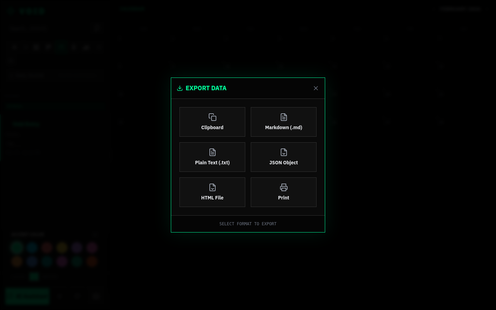<br>**Export Modal** | 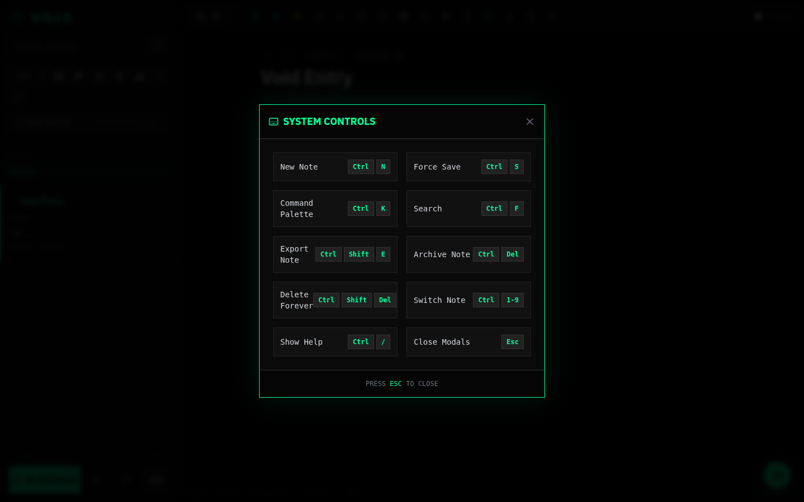<br>**Keyboard Shortcuts** |
| 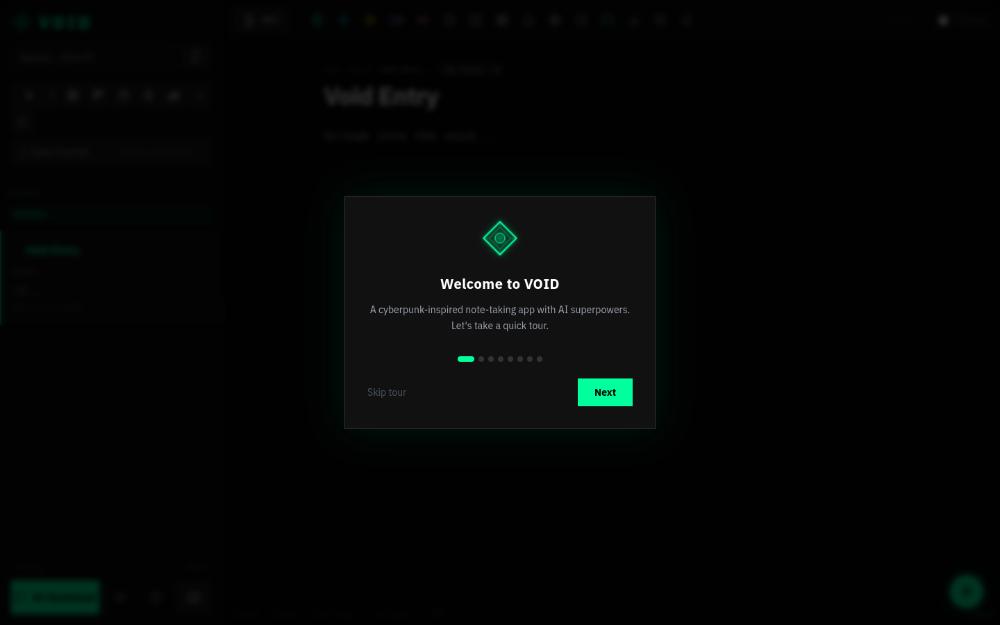<br>**Onboarding** | 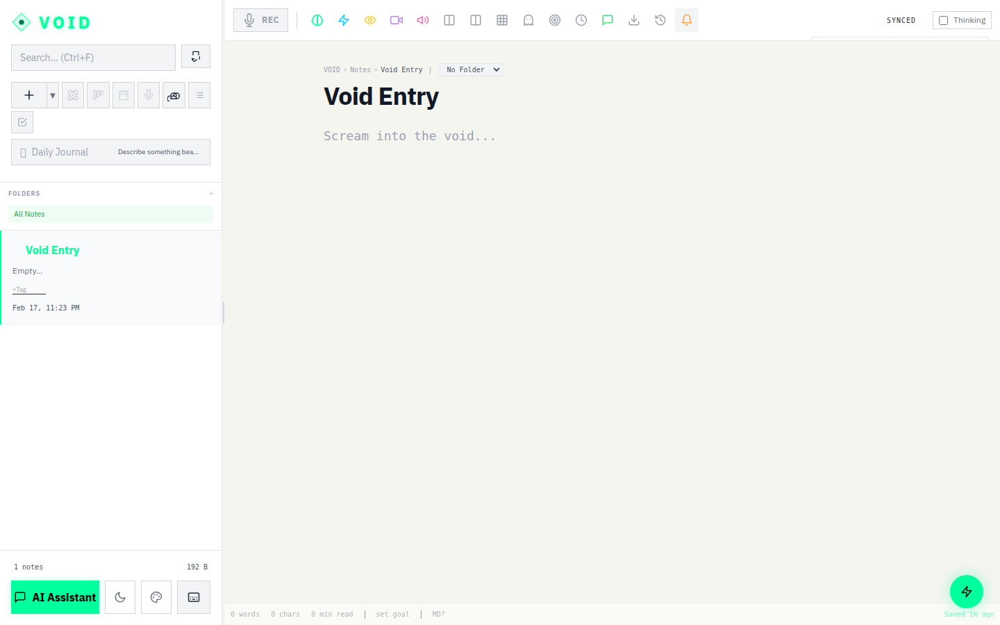<br>**Set Reminder** |
| <br>**Pomodoro Timer** | 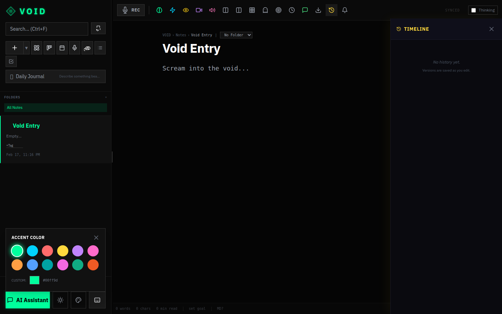<br>**Version History** |
| <br>**Sidebar** | 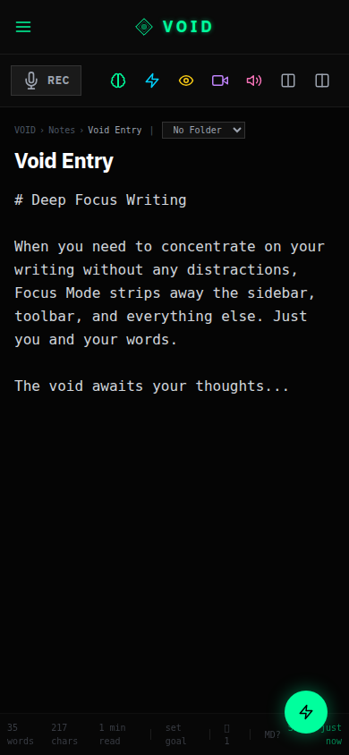<br>**Mobile View** |
| 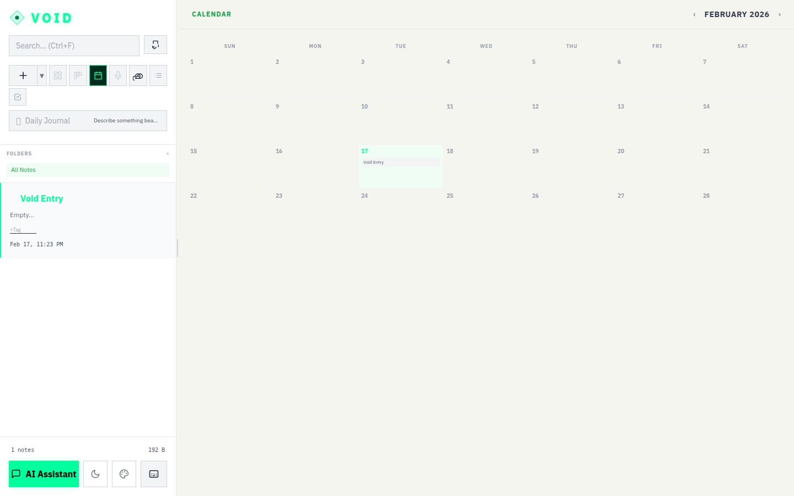<br>**Light Theme Calendar** | |

</details>

<br>

---

<br>

## ◈ Roadmap

**System Evolution: 42 of 100 modules online.**

```
SECTOR              COMPLETE    STATUS BAR
─────────────────────────────────────────────────────────────
Editor              15/15       ████████████████████████  FULL
Organization        10/10       ████████████████████████  FULL
AI / Intelligence    0/10       ░░░░░░░░░░░░░░░░░░░░░░░░  PLANNED
Collaboration        0/7        ░░░░░░░░░░░░░░░░░░░░░░░░  PLANNED
Data & Storage       2/8        █████░░░░░░░░░░░░░░░░░░░  25%
Export & Sharing     2/7        ██████░░░░░░░░░░░░░░░░░░  29%
Multimedia           0/7        ░░░░░░░░░░░░░░░░░░░░░░░░  PLANNED
UI / UX             11/11       ████████████████████████  FULL
Integrations         0/10       ░░░░░░░░░░░░░░░░░░░░░░░░  PLANNED
Productivity         8/8        ████████████████████████  FULL
Performance          2/6        ████████░░░░░░░░░░░░░░░░  33%
─────────────────────────────────────────────────────────────
TOTAL               42/100      ██████████░░░░░░░░░░░░░░  42%
```

<details>
<summary><b>◇ Full 100-Feature Checklist</b></summary>

<br>

#### ✅ Implemented (42)

- [x] Code syntax highlighting
- [x] Tables support
- [x] Checklists with progress tracking
- [x] Embeddable link preview cards
- [x] Split-pane editing
- [x] Focus / zen mode
- [x] Word count goals and writing streaks
- [x] Version history / undo timeline
- [x] 6 note templates
- [x] Slash commands
- [x] Collapsible sections
- [x] Footnotes and annotations
- [x] Wiki-style `[[note]]` linking
- [x] Pomodoro timer
- [x] Note reminders
- [x] Folders / nested structure
- [x] Pinned / favorited notes
- [x] Archive functionality
- [x] Bulk actions
- [x] Custom sort options
- [x] Color-coded tags
- [x] Recent notes panel
- [x] Trash with restore
- [x] Storage usage indicator
- [x] Export to HTML
- [x] Print-friendly view
- [x] Light/dark theme switcher
- [x] Custom theme editor
- [x] Responsive mobile layout
- [x] Customizable sidebar width
- [x] Compact vs comfortable density
- [x] Animated transitions
- [x] Breadcrumb navigation
- [x] Command palette (Ctrl+K)
- [x] Onboarding walkthrough
- [x] Notification system
- [x] Reminders and due dates
- [x] Pomodoro timer
- [x] Daily journal prompts
- [x] Kanban board view
- [x] Calendar view
- [x] Quick capture button
- [x] Accessibility (ARIA, screen reader)
- [x] Keyboard navigation

#### 🔲 Planned (58)

- [ ] AI auto-tagging
- [ ] AI note summarization pipeline
- [ ] AI writing autocomplete
- [ ] Semantic search across notes
- [ ] AI tone rewriting
- [ ] AI translation
- [ ] AI flashcards
- [ ] AI grammar check
- [ ] Chat context awareness
- [ ] AI table of contents
- [ ] Rich text WYSIWYG
- [ ] Drag-and-drop images
- [ ] Drawing canvas
- [ ] Knowledge graph visualization
- [ ] Note categories
- [ ] Real-time collaboration
- [ ] Shareable public links
- [ ] Comments on shared notes
- [ ] User accounts
- [ ] Team workspaces
- [ ] Permission levels
- [ ] Activity feed
- [ ] PostgreSQL backend
- [ ] Full-text search indexing
- [ ] Automatic cloud backup
- [ ] Import from Notion/Evernote/Obsidian
- [ ] Note encryption
- [ ] Offline-first with sync
- [ ] Export to PDF
- [ ] Export to DOCX
- [ ] Email a note
- [ ] Publish as blog
- [ ] RSS feed
- [ ] Voice transcription improvements
- [ ] Audio playback controls
- [ ] Video embedding
- [ ] Image gallery
- [ ] OCR
- [ ] Screen recording
- [ ] File attachments
- [ ] PWA support
- [ ] Stripe integration
- [ ] GitHub sync
- [ ] Slack integration
- [ ] Calendar integration
- [ ] Notion import/export
- [ ] Zapier webhooks
- [ ] Email-to-note
- [ ] Browser extension
- [ ] OpenAI alternative
- [ ] Dropbox/OneDrive sync
- [ ] Habit tracker
- [ ] Lazy loading
- [ ] Image compression
- [ ] Service worker
- [ ] DB migration to Postgres
- [ ] Rate limiting
- [ ] Markdown shortcuts cheat sheet

</details>

<br>

---

<br>

## ◈ Documentation

Deep-dive documentation is available in the [`docs/`](./docs) directory:

| Document | Description |
|:--|:--|
| [**DEVELOPER_GUIDE.md**](./docs/DEVELOPER_GUIDE.md) | Setup, conventions, step-by-step guides |
| [**ARCHITECTURE.md**](./docs/ARCHITECTURE.md) | System diagrams, data flow, storage tiers |
| [**COMPONENT_REFERENCE.md**](./docs/COMPONENT_REFERENCE.md) | Full props/state/features for all components |
| [**SERVICES_AND_STATE.md**](./docs/SERVICES_AND_STATE.md) | Service APIs, AI model matrix, function declarations |
| [**USER_GUIDE.md**](./docs/USER_GUIDE.md) | End-user feature walkthroughs |
| [**USER_MANUAL.md**](./docs/USER_MANUAL.md) | Complete operational manual |
| [**IMPROVEMENT_CHECKLIST.md**](./docs/IMPROVEMENT_CHECKLIST.md) | 100-item feature checklist with status |

<details>
<summary><b>◇ Feature Deep-Dives</b></summary>

<br>

| Document | System |
|:--|:--|
| [**NEURAL_FUSION.md**](./docs/features/NEURAL_FUSION.md) | Concept synthesis engine |
| [**HAUNT_SYSTEM.md**](./docs/features/HAUNT_SYSTEM.md) | Semantic association finder |
| [**LIVE_MATRIX.md**](./docs/features/LIVE_MATRIX.md) | Real-time voice AI architecture |
| [**OMNIPOTENT_CHAT.md**](./docs/features/OMNIPOTENT_CHAT.md) | Function calling and system prompts |
| [**MULTIMEDIA_ENGINE.md**](./docs/features/MULTIMEDIA_ENGINE.md) | Imagen 3 and Veo 2 pipelines |
| [**DATA_LAYER.md**](./docs/features/DATA_LAYER.md) | Persistence and Google Drive sync |

</details>

<br>

---

<br>

<div align="center">

```
◇─────────────────────────────────────────────◇
│                                               │
│   Built with obsession.                       │
│   Designed with sharp edges.                  │
│   Powered by the void between your thoughts.  │
│                                               │
◇─────────────────────────────────────────────◇
```

**VOID** — *Write into the abyss. The abyss writes back.*

<br>


</div>
